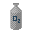

[< Back to Contents](../README.md)

# 5. Adding Items

## 5.1 Texture

To add a custom item, first create an item texture and place it in the `Items` folder.

**Important!** Item texture names are also their IDs. They must be unique.

## 5.2 Data
Next, add the item description in `items.json`.

### Common Parameters:
<table>
  <thead>
    <tr>
      <th>Parameter</th>
      <th>Description</th>
      <th>Data Type</th>
    </tr>
  </thead>
  <tbody>
    <tr>
      <td><strong>Name</strong></td>
      <td>Item name</td>
      <td>Text</td>
    </tr>
    <tr>
      <td><strong>MaxStack</strong></td>
      <td>Maximum items per slot</td>
      <td>0–255</td>
    </tr>
    <tr>
      <td><strong>ModelDepth</strong></td>
      <td>Model thickness in pixels</td>
      <td>Float (x.xx)</td>
    </tr>
    <tr>
      <td><strong>Category</strong></td>
      <td>Crafting table category (optional)</td>
      <td>Text</td>
    </tr>
    <tr>
      <td><strong>Sprite</strong></td>
      <td>Item texture</td>
      <td>Texture name</td>
    </tr>
    <tr>
      <td><strong>Type</strong></td>
      <td>Item type</td>
      <td>Type</td>
    </tr>
  </tbody>
</table>

### Item Types:
<table>
  <thead>
    <tr>
      <th>Type</th>
      <th>Description</th>
    </tr>
  </thead>
  <tbody>
    <tr>
      <td><strong>item</strong></td>
      <td>Default type for items</td>
    </tr>
    <tr>
      <td><strong>drill</strong></td>
      <td>Drill item</td>
    </tr>
    <tr>
      <td><strong>weapon</strong></td>
      <td>Weapon item</td>
    </tr>
    <tr>
      <td><strong>consumable</strong></td>
      <td>Consumable item</td>
    </tr>
  </tbody>
</table>

## 5.2.1 Adding a Drill
Set the item type to `drill`.

### Parameters:
<table>
  <thead>
    <tr>
      <th>Parameter</th>
      <th>Description</th>
      <th>Data Type</th>
    </tr>
  </thead>
  <tbody>
    <tr>
      <td><strong>Power</strong></td>
      <td>Drill power</td>
      <td>0–255</td>
    </tr>
  </tbody>
</table>

## 5.2.2 Adding a Consumable
Set the item type to `consumable`.

### Parameters:
<table>
  <thead>
    <tr>
      <th>Parameter</th>
      <th>Description</th>
      <th>Data Type</th>
    </tr>
  </thead>
  <tbody>
    <tr>
      <td><strong>PowerAmount</strong></td>
      <td>Charge provided</td>
      <td>0–255</td>
    </tr>
    <tr>
      <td><strong>HealAmount</strong></td>
      <td>Health restored</td>
      <td>0–255</td>
    </tr>
    <tr>
      <td><strong>Sound</strong></td>
      <td>Sound when consumed</td>
      <td>Sound name</td>
    </tr>
  </tbody>
</table>

## 5.2.3 Adding a Weapon
Set the item type to `weapon`.

### Parameters:
<table>
  <thead>
    <tr>
      <th>Parameter</th>
      <th>Description</th>
      <th>Data Type</th>
    </tr>
  </thead>
  <tbody>
    <tr>
      <td><strong>Damage</strong></td>
      <td>Weapon damage</td>
      <td>0–255</td>
    </tr>
    <tr>
      <td><strong>ReloadTime</strong></td>
      <td>Reload time (in ticks, 1 second = 20 ticks)</td>
      <td>0–255</td>
    </tr>
    <tr>
      <td><strong>Spread</strong></td>
      <td>Spread angle</td>
      <td>Number</td>
    </tr>
    <tr>
      <td><strong>Pushback</strong></td>
      <td>Pushback force</td>
      <td>0–1</td>
    </tr>
    <tr>
      <td><strong>AnimationSpeed</strong></td>
      <td>Animation speed</td>
      <td>0.00+</td>
    </tr>
    <tr>
      <td><strong>PowerUsage</strong></td>
      <td>Power usage per shot</td>
      <td>0–255</td>
    </tr>
    <tr>
      <td><strong>ShotSound</strong></td>
      <td>Shooting sound</td>
      <td>Sound name</td>
    </tr>
    <tr>
      <td><strong>Projectile</strong></td>
      <td>Projectile name from <code>projectiles.json</code></td>
      <td>Name</td>
    </tr>
  </tbody>
</table>

[< Back to Contents](../README.md)
